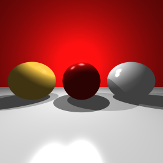

# Java-raytracer
Image rendering using ray tracing technique. It sends rays from camera and checks for intersection between rays and 
objects. It allows to imitate different materials like transperent, reflective or standard phong material on objects. Application
uses sampler which increases image quality.
 

# Example images

